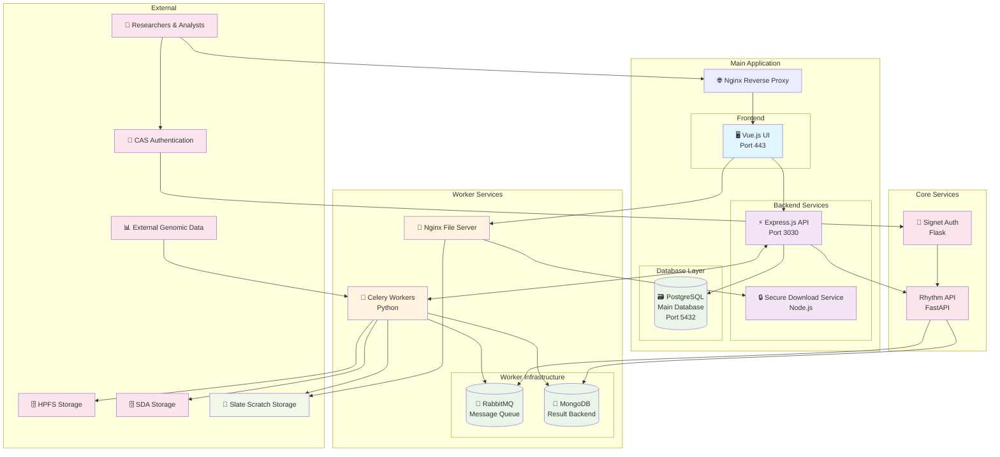
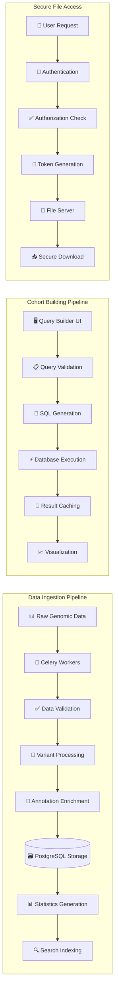
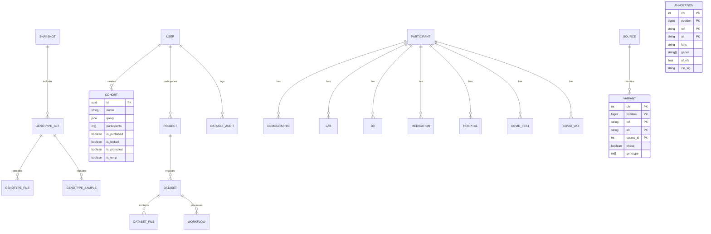
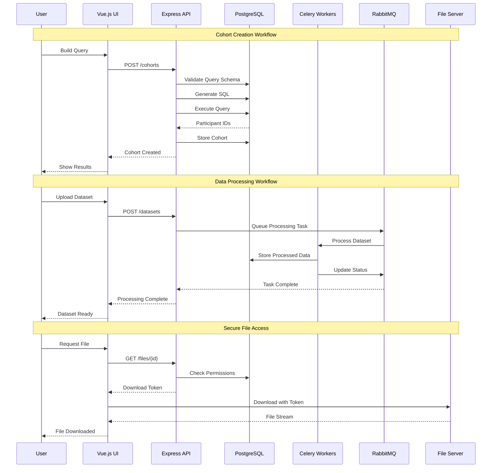

# Biobank System Architecture

## High-Level System Architecture



## Data Flow Architecture



## Database Schema Overview



## Service Communication Patterns




## Deployment Architecture

```mermaid
graph TB
    subgraph "Docker Compose Environment"
        direction TB
        
        subgraph "Application Containers"
            UIContainer[🐳 UI Container<br/>node:19<br/>Vite Dev Server]
            APIContainer[🐳 API Container<br/>node:19<br/>Express + Prisma]
        end
        
        subgraph "Database Containers"
            PostgresContainer[🐳 PostgreSQL Container<br/>postgres:14.5<br/>Partitioned Tables]
        end
        
        subgraph "External Services"
            WorkerServices[🔄 Python Workers<br/>Poetry + Celery]
            SecureDownloadService[🔒 Secure Download<br/>Node.js Service]
        end
        
        subgraph "Volumes"
            UIModules[📦 ui_modules]
            APIModules[📦 api_modules]
            DBData[💾 PostgreSQL Data]
        end
    end
    
    subgraph "Host Network"
        LocalHost[🖥️ localhost:443 → UI]
        APIHost[⚡ localhost:3030 → API]
        DBHost[🗃️ localhost:5432 → DB]
    end
    
    UIContainer --> UIModules
    APIContainer --> APIModules
    PostgresContainer --> DBData
    
    LocalHost --> UIContainer
    APIHost --> APIContainer
    DBHost --> PostgresContainer
