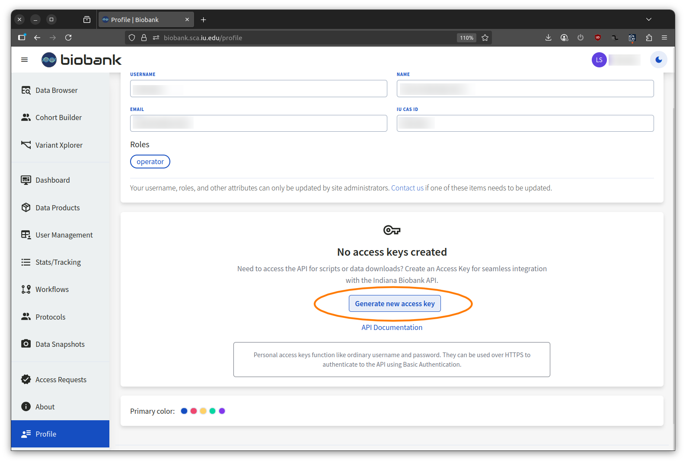
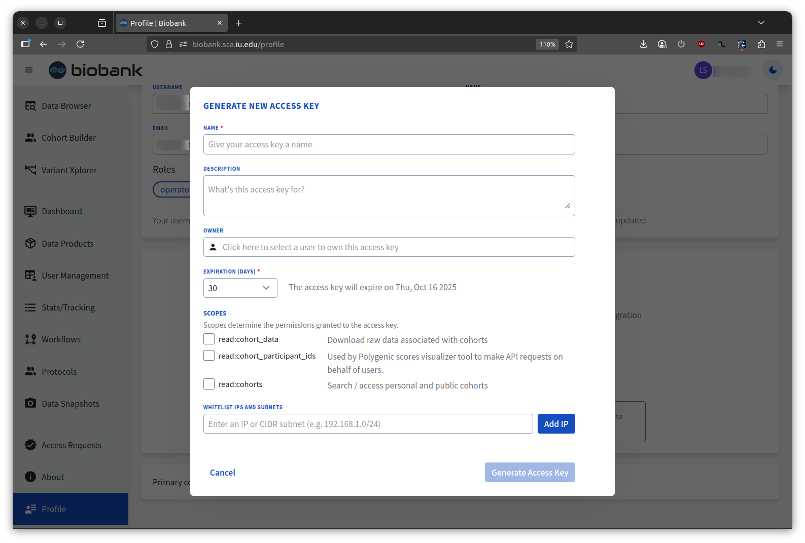

# API Client

A CLI utility (`biobank-client`) is available inside the Trusted Research Environment for retrieving data from the research portal programmatically.

::: tip Using the client outside the TRE?
If you want to run `biobank-client` in an automated pipeline or on your own machine, see the [API Client Container guide](api-client-container.md) instead.
:::

## Setting Up Credentials

Before using the client, you'll need an Access Key. Generate one from your profile page in the research portal:





Once you have a key, create a `.env` file in your home directory inside the TRE:

```bash
export HOST={{API_URL}}
export BASIC_AUTH=apiKey:apiSecret
```

Source it before running the client:

```bash
source ~/.env
```

## Listing Files for a Cohort

To see what data files are available for an approved cohort, run:

```bash
biobank-client getCohortFiles id=<cohort-id>
```

This returns a paginated list of files. Use `limit` and `offset` to page through large results:

```bash
biobank-client getCohortFiles id=<cohort-id> limit=50 offset=0
```

## Downloading a File

To download a specific file by its ID:

```bash
curl -J -O -u apiKey:apiSecret -X GET "{{API_URL}}/cohorts/files/download/<file-id>"
```

The `-J` flag uses the server-supplied filename and `-O` saves it to the current directory.

::: warning Raw genetic data requires TRE access
Downloading raw genetic sequencing data is only permitted from within the Trusted Research Environment. This is one of the primary reasons the TRE is required for working with participant-level genomic data.
:::

::: tip On-demand staging
Raw sequencing data is staged on-demand and may not be immediately available. If a download returns a `202` response, the file is being prepared — wait a moment and try again.
:::

## Direct API Access

If you prefer to make API calls directly rather than use the CLI, the full API reference is available at:

[{{WEBSITE_URL}}api/doc/]({{WEBSITE_URL}}api/doc/)

## Command Reference

Full list of available operations:

```
biobank-client -h
```

```
Biobank API command line client (API version 1.0.0)

Usage

  biobank-client [-h|--help] [-V|--version] [--about] [<curl-options>]
           [-ac|--accept <mime-type>] [-ct,--content-type <mime-type>]
           [--host <url>] [--dry-run] [-nc|--no-colors] <operation> [-h|--help]
           [<headers>] [<parameters>] [<body-parameters>]

  - <url> - endpoint of the REST service without basepath
           Can also be specified in HOST environment variable.
  - <curl-options> - any valid cURL options can be passed before <operation>
  - <mime-type> - either full mime-type or one of supported abbreviations:
                   (text, html, md, csv, css, rtf, json, xml, yaml, js, bin,
                    rdf, jpg, png, gif, bmp, tiff)
  - <headers> - HTTP headers can be passed in the form HEADER:VALUE
  - <parameters> - REST operation parameters can be passed in the following
                   forms:
                   * KEY=VALUE - path or query parameters
  - <body-parameters> - simple JSON body content (first level only) can be build
                        using the following arguments:
                        * KEY==VALUE - body parameters which will be added to body
                                      JSON as '{ ..., "KEY": "VALUE", ... }'
                        * KEY:=VALUE - body parameters which will be added to body
                                      JSON as '{ ..., "KEY": VALUE, ... }'

Authentication methods

  - Basic AUTH - add '-u <username>:<password>' before <operation>
                 or export BASIC_AUTH='<username>:<password>'

Operations (grouped by tags)

[cohorts]
  downloadCohortFile       Download a cohort file (AUTH)
  getCohortById            Get a cohort by id (AUTH)
  getCohortFiles           List data files for a cohort (AUTH)
  getCohortFilesSummary    Get a summary of files in a cohort (AUTH)
  getCohortParticipantIds  Get participant IB ids of a cohort (AUTH)
  searchCohorts            Search cohorts (AUTH)

[general]
  health   (AUTH)
```

For detailed parameters on any operation, run `biobank-client <operation> -h`.
