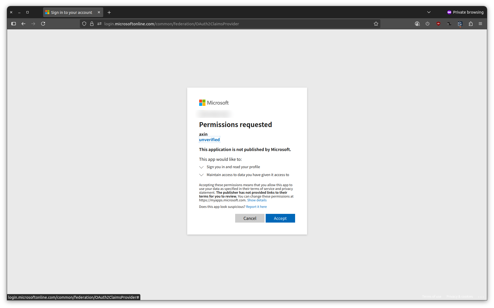
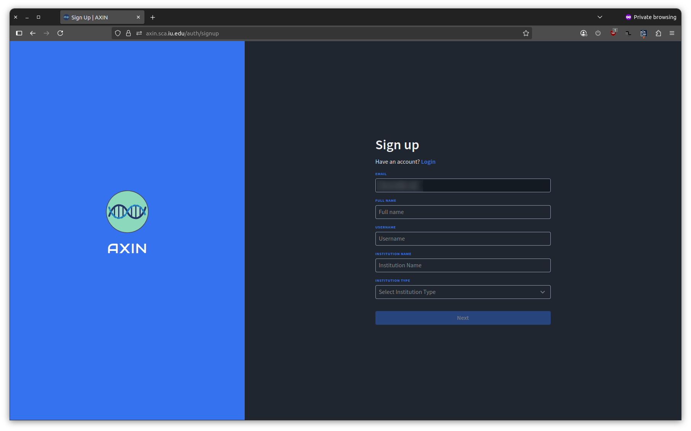
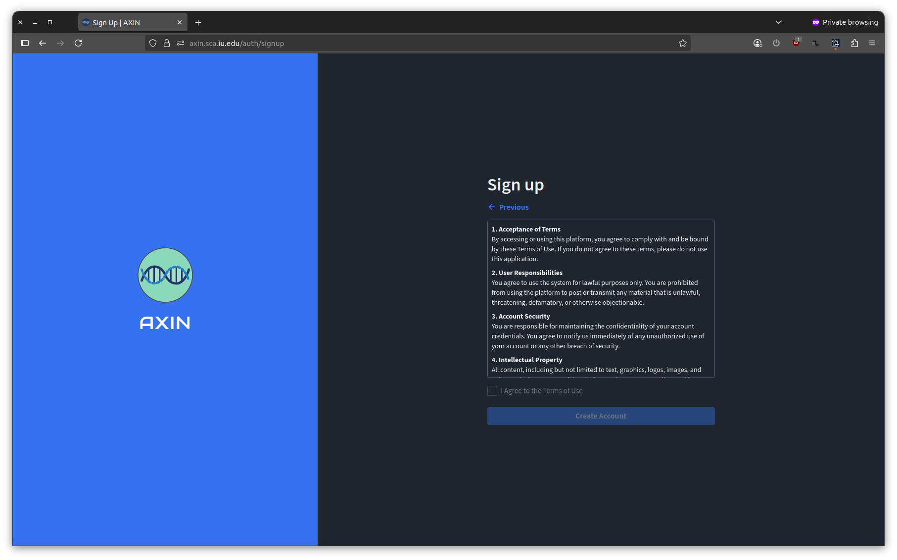

# Getting Started with {{PLATFORM_FULL_NAME}}

## Logging In

1. Go to [{{WEBSITE_URL}}]({{WEBSITE_URL}})
2. Click **Login** and select your institution's identity provider (e.g., Microsoft)
3. Complete authentication through your institution's login page

If this is your first time logging in, you will be redirected to the registration form automatically after authenticating.

## Creating Your Account

After your first login, you'll be asked to complete a short registration form before you can access the platform:

Fill in:
- Full name
- Institution or organization
- Department or research area
- Brief description of your research interests

Once submitted, you'll be asked to review and accept the Terms and Conditions:

After accepting, your account will be created and you'll be taken to the platform.

## Next Steps

- **[Data Browser](/guide/data-browser.md)** — explore what clinical and genomic data is available
- **[Cohort Builder](/guide/cohort-builder.md)** — build a cohort of participants matching your research criteria
- **[Variant Xplorer](/guide/variant-explorer.md)** — investigate genetic variants across the participant population

## Support

For account-related issues, contact {{SUPPORT_EMAIL}}.
