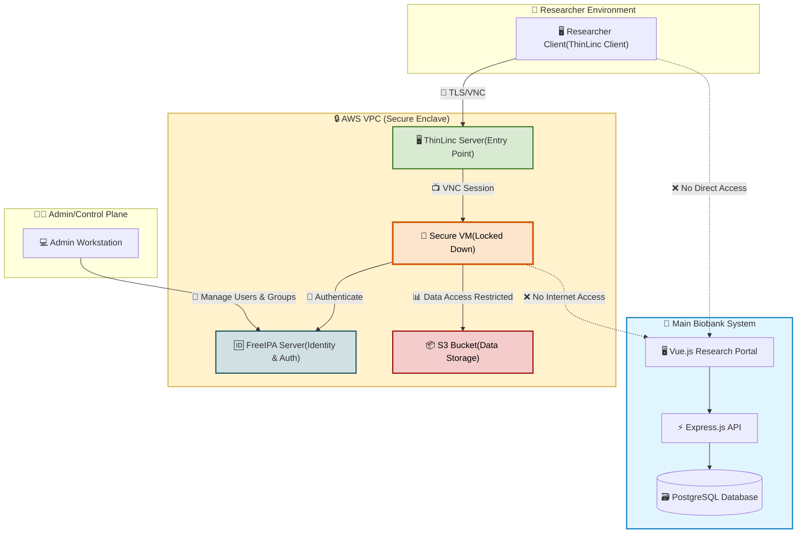

# Secure Enclave Access

## What is a Secure Enclave?

A secure enclave is a controlled computing environment that enforces strict data access, auditing, and computational restrictions. It ensures compliance with regulatory and ethical standards while minimizing the risk of unauthorized data exposure or misuse.

## Why is it Necessary?

Using a secure enclave is necessary when working with deidentified {{ORGANIZATION}} participant data to prevent unauthorized data exfiltration and re-identification of participants. 

## How to Access the Secure Enclave

### Prerequisites

Before requesting access to the secure enclave, you must:

1. Create a cohort in the {{PLATFORM_FULL_NAME}}
3. Prepare a formal request detailing your research objectives and data needs

### Request Process

1. Submit a formal request to access participant-level clinical, phenotype, and genomic data for your locked cohort
2. Your request will be reviewed by the data governance committee
3. Upon approval, you will receive credentials and instructions for accessing the secure enclave
4. You can then conduct analyses within the enclave environment in compliance with data governance and privacy protections

## Accessing the Secure Enclave

### System Overview

The secure enclave is a virtual machine deployed in AWS with limited networking access for security purposes. Access is provided through a ThinLinc remote desktop client that runs in your web browser.

### Receiving Your Credentials

Once your data request has been approved, you will receive:

- A unique username specific to the secure enclave system
- A secure password (different from your other institutional accounts)
- The secure enclave access URL
- Any additional authentication requirements

**Important:** Your credentials will be provided through a secure sharing mechanism (such as [IU Secure Share](https://secureshare.iu.edu/)). Do not share these credentials with anyone.

### Step-by-Step Access Instructions

#### 1. Initial Connection

1. Open a modern web browser (Chrome, Firefox, Safari, or Edge recommended)
2. Navigate to the secure enclave access URL provided in your approval notification
3. You will see the ThinLinc web client login page

#### 2. Authentication

1. Enter your unique username in the "Username" field
2. Enter your secure password in the "Password" field
3. Leave the "Server" field as the default (unless instructed otherwise)
4. Click "Connect" to establish the connection

#### 3. Desktop Environment

Once connected, you will see a Linux desktop environment with:

- A taskbar at the bottom of the screen
- Desktop icons for common applications
- A file manager for navigating the system
- Terminal access for command-line operations

#### 4. Navigation and Basic Operations

**File Management:**
- Use the file manager to browse directories and files
- Your home directory contains your personal workspace
- Shared data will be available in designated directories (typically `/data` or `/shared`)

**Applications:**
- Access applications through the desktop menu or taskbar
- Common tools include text editors, statistical software, and development environments
- Additional software can be requested through the support channels

**Terminal Access:**
- Open a terminal from the desktop menu or taskbar
- Use standard Linux commands for file operations and analysis
- Install additional packages using the system package manager (subject to approval)

#### 5. Working with Data

**Data Location:**
- Your approved cohort data will be pre-loaded in designated directories
- Clinical data is typically in structured formats (CSV, TSV, or database files)
- Genomic data may be in standard formats (VCF, BAM, FASTQ, etc.)

**Analysis Environment:**
- Pre-installed analysis tools are available for immediate use
- Save your work frequently to your home directory

#### 6. Session Management

**Saving Your Work:**
- Always save your analysis scripts and results before disconnecting
- Use descriptive filenames and organize your work in folders
- Consider using screen or tmux for long-running processes

**Disconnecting:**
- Close applications properly before logging out
- Use the logout option from the desktop menu
- Simply closing the browser tab will disconnect but may leave processes running

## Data Export Policies

While raw data cannot be exported from the secure enclave, researchers can export:

- Analysis results
- Statistical summaries
- Aggregated data
- Visualizations
- Code and analysis workflows

All exports are subject to review to ensure they do not contain identifiable information.

## Secure Enclave Architecture

**Security Features:**
- 🚫 **Network Isolation**: Secure enclave operates on completely separate network from main research portal
- 🔒 **No Outbound Internet**: Secure VM has no internet access after VNC session is established
- 🔐 **Controlled Access**: All access through ThinLinc server with authenticated sessions
- 👥 **Centralized Identity**: FreeIPA manages all user authentication and authorization
- 📊 **Restricted Data Access**: S3 bucket access is strictly controlled and audited

