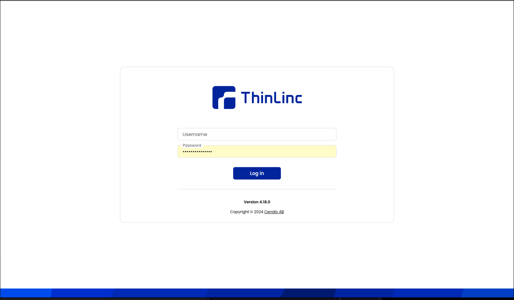

# Trusted Research Environment Access

## What is a Trusted Research Environment?

A trusted research environment is a controlled computing environment that enforces strict data access, auditing, and computational restrictions. They are similar to a secure enclave. It ensures compliance with regulatory and ethical standards while minimizing the risk of unauthorized data exposure or misuse.

## Why is it Necessary?

Using a trusted research environment is necessary when working with deidentified {{ORGANIZATION}} participant data to prevent unauthorized data exfiltration and re-identification of participants. 

## Request Process

1. [Create a cohort](cohort-builder.md#building-a-cohort)
2. [Submit a formal request to access participant-level clinical, phenotype, and genomic data for your locked cohort](cohort-builder.md#requesting-data-access)
3. Your request will be reviewed by the data governance committee
4. Upon approval, you can access the trusted research environment using your institutional Microsoft account
5. You can then conduct analyses within the enclave environment in compliance with data governance and privacy protections

## Accessing the Trusted Research Environment

### System Overview

The trusted research environment is a virtual machine deployed in AWS with limited networking access for security purposes. Access is provided through a web-based remote desktop client that runs in your browser.

### Authentication

Your approved project is linked to your institutional Microsoft account. To access the TRE:

1. Navigate to the trusted research environment access URL provided in your approval notification
2. Sign in with your institutional Microsoft credentials (e.g., `username@iu.edu`)

For details on how to use the Trusted Research Environment, please refer to the [Trusted Research Environment Usage](/guide/trusted-research-environment-usage.md) document.

## Data Export Policies

While raw data cannot be exported from the trusted research environment, researchers can export:

- Analysis results
- Statistical summaries
- Visualizations
- Code and analysis workflows

All exports are subject to review to ensure they do not contain identifiable information. Once you've completed your analysis, contact the data stewards by emailing  {{SUPPORT_EMAIL}} for inquiries about extracting results data from the secure enclave.