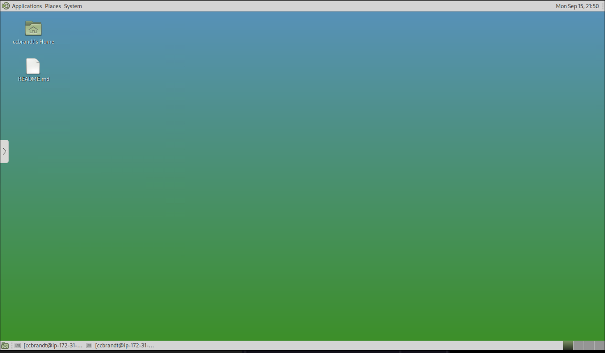
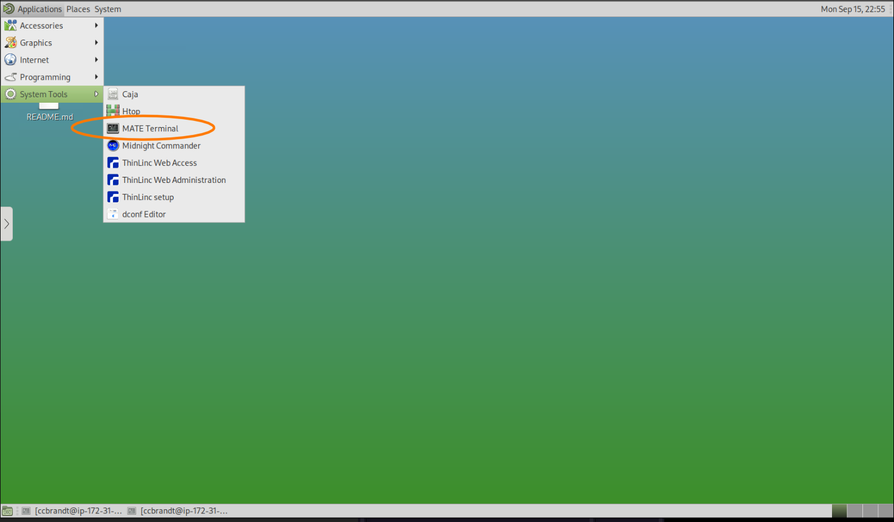
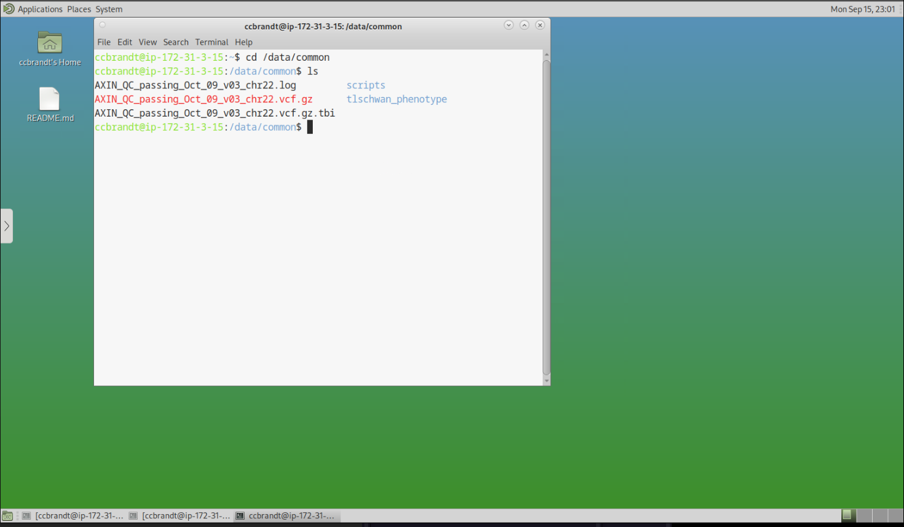

# Trusted Research Environment Usage

This document outlines the usage of the Trusted Research Environment (TRE).

If you haven't already, please [request and connect to your environment](/guide/trusted-research-environment-setup.md) first.

## Desktop Environment

Once connected, you will see a Linux desktop environment:




Terminal Application:





### Working with Data

Shared data will be available in designated directories (typically `/data/common`)

**Data Location:**
- Your approved cohort data will be pre-loaded in designated directories
- Clinical data is typically in structured formats (CSV, TSV, or database files)
- Genomic data may be in standard formats (VCF, BAM, FASTQ, etc.)

Please configure your scripts to write any outputs to `/data/output`


In order to conserve cloud resources, raw sequencing data is made available 'on-demand' by default. For downloading raw data within the TRE, please refer to the [API client guide](api-client.md)

### Running Analysis

```
cd /data/common/scripts
R < example_script.r --no-save
```


### Available Analysis Tools

The Trusted Research Environment comes with a suite of pre-installed tools for various types of analysis:

#### General Purpose Tools
- **RStudio**: An integrated development environment (IDE) for R.
- **R**: A language and environment for statistical computing and graphics, with various packages installed, including Bioconductor.
- **Python**: A versatile programming language widely used for data analysis, with common scientific libraries.
- **Jupyter Notebooks**: An interactive computing environment that allows you to create and share documents containing live code, equations, visualizations, and narrative text.

#### Genomic Analysis Tools
- **PLINK 1.9**: A whole-genome association analysis toolset.
- **PLINK 2.0**: A next-generation whole-genome association analysis toolset, offering improved performance and new features.
- **IGV (Integrative Genomics Viewer)**: A high-performance visualization tool for genomic data.
- **BCFtools**: A set of utilities for variant calling and manipulating VCF and BCF files.
- **VCFTools**: A program package designed to work with VCF files, including filtering, merging, and comparing.
- **BEDTools**: A versatile toolset for genomic feature manipulation.
- **GATK (Genome Analysis Toolkit)**: A comprehensive toolkit for variant discovery in high-throughput sequencing data, including tools for Somatic Variant (SV), Copy Number Variant (CNV), and Pathogen Sequencing (Pathseq) analysis.
- **HLA Caller**: Tools for Human Leukocyte Antigen (HLA) typing (e.g., xHLA, HiBAG).
- **samtools**: Utilities for interacting with and post-processing sequence alignments in SAM, BAM, and CRAM formats.
- **tabix**: A generic indexer for TAB-delimited genome position files.
- **htslib**: A C library for reading/writing high-throughput sequencing data formats.
- **minconda**: A free minimal installer for conda.
- **annovar**: A tool for annotating genetic variants.
- **METAL**: A tool for meta-analysis of genome-wide association scans.

#### R Packages

The R environment includes a comprehensive set of packages for statistical analysis and bioinformatics:

- `data.table`: Extension of `data.frame` for faster data manipulation.
- `DESeq2`: Differential gene expression analysis based on the negative binomial distribution.
- `GWASTOOLS`: Tools for quality control and analysis of genome-wide association studies.
- `biomaRt`: R interface to BioMart online biological data resources.
- `gtools`: Various R programming tools.
- `dplyr`: A grammar of data manipulation, providing a consistent set of verbs that help you solve the most common data manipulation challenges.
- `ggplot2`: A system for declaratively creating graphics, based on The Grammar of Graphics.
- `SKAT`: Sequence Kernel Association Test for genetic association studies.
- `robustSKAT`: Robust Sequence Kernel Association Test.
- `HIBAG`: HLA Imputation Based on Allele Gene.
- `stringr`: A consistent, simple, and easy-to-use set of wrappers for common string operations.
- `foreach`: Provides a mechanism for iterating over elements in a collection, without the need for explicit loop counters.
- `SNPRelate`: Parallel computing toolset for genome-wide association studies.
- `readxl`: Read Excel files into R.
- `tidyverse`: An opinionated collection of R packages designed for data science.
- `ggpubr`: `ggplot2` based publication ready plots.
- `survplot`: Tools for plotting survival data.
- All their respective dependencies.
