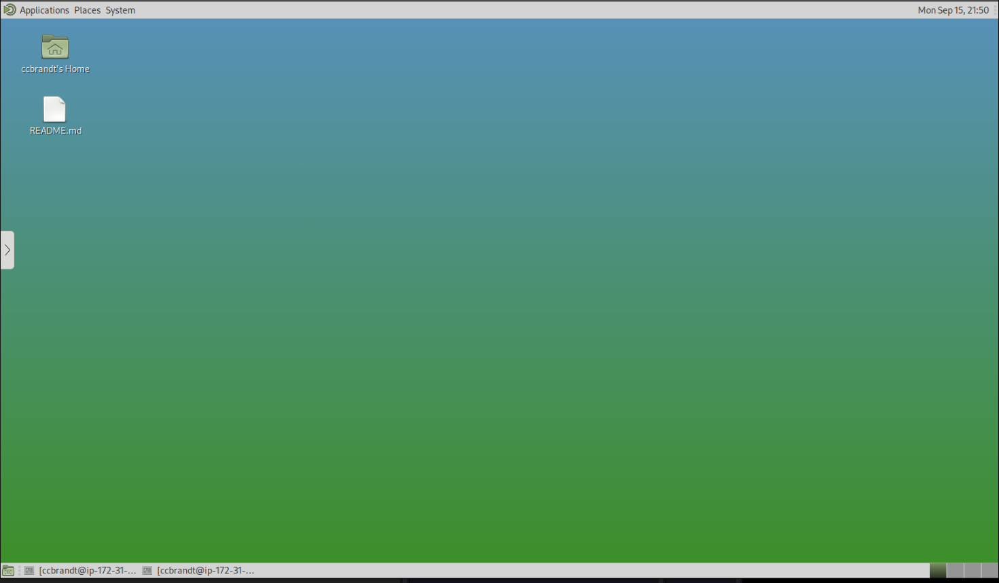
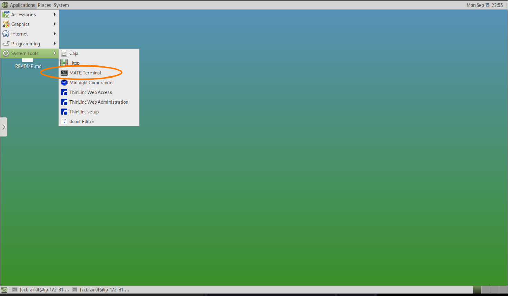
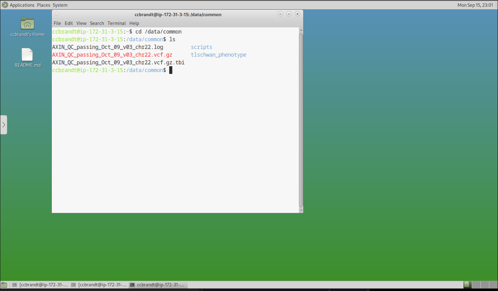

# Trusted Research Environment Usage

This document outlines the usage of the Trusted Research Environment (TRE).

If you haven't already, please [request and connect to your environment](/guide/trusted-research-environment-setup.md) first.

## Desktop Environment

Once connected, you will see a Linux desktop environment in your web browser:




Terminal Application:





## Working with Data

Shared data will be available in designated directories (typically `/data/common`)

**Data Location:**
- Your approved cohort data will be pre-loaded in designated directories
- Clinical data is typically in structured formats (CSV, TSV, or database files)
- Genomic data may be in standard formats (VCF, BAM, FASTQ, etc.)

**Genome Build:** Genotype data delivered through the platform is aligned to **GRCh38**. If you're staging your own reference data (e.g. an imputation reference panel) or comparing against externally-published resources, make sure the build matches — GRCh37/hg19-based reference files are not compatible without a liftover step.

Please configure your scripts to write any outputs to `/data/output`


In order to conserve cloud resources, raw sequencing data is made available 'on-demand' by default. For downloading raw data within the TRE, please refer to the [API client guide](api-client.md)

## Network Access

TRE workspaces have **no outbound internet access** by design — this is a data governance requirement, not a configuration gap. In practice this means:

- Any workflow step that expects to reach an external service at runtime (an imputation server such as Michigan or TOPMed, a package installer that fetches from the internet, a reference database download) will not work from inside the workspace.
- Equivalent local tools and pre-staged reference data are the supported alternative — for example, local phasing/imputation against a reference panel staged into your workspace, rather than uploading to an external imputation service. See the Genomic Analysis Tools list below for what's available today.
- If your analysis plan depends on a specific external service, tell us before you start — there may be a local equivalent, or it may need a separate discussion about whether/how it fits the no-egress requirement.
- If you need software or reference data that isn't listed below, contact the TRE team — new tools are added to the workspace image on request; there's currently no self-service form, so just reach out directly.

## Running Analysis

```
cd /data/common/scripts
R < example_script.r --no-save
```


## Available Analysis Tools

The Trusted Research Environment comes with a suite of pre-installed tools for various types of analysis:

#### General Purpose Tools
- **RStudio**: An integrated development environment (IDE) for R.
- **R**: A language and environment for statistical computing and graphics, with various packages installed, including Bioconductor.
- **Python**: A versatile programming language widely used for data analysis, with common scientific libraries.
- **Jupyter Notebooks**: An interactive computing environment that allows you to create and share documents containing live code, equations, visualizations, and narrative text.

#### Genomic Analysis Tools
- **PLINK 1.9** and **PLINK 2.0**: Whole-genome association analysis toolsets.
- **GCTA**: GRM computation, GREML heritability estimation, and COJO conditional/joint association analysis.
- **REGENIE**: Whole-genome regression for biobank-scale GWAS; preferred over PLINK mixed models at larger cohort sizes.
- **SAIGE** and **PRSice-2**: Mixed-model association for case-control imbalance, and polygenic risk score computation, respectively. These install best-effort during our build process — if either seems to be missing from your workspace, let us know rather than assuming it should be there.
- **Nextflow** + **pgsc_calc**: Pipeline runner and the pgscatalog polygenic-score/ancestry pipeline, pre-cached for offline use (no internet access needed to run it).
- **IGV (Integrative Genomics Viewer)**: A high-performance visualization tool for genomic data.
- **GATK (Genome Analysis Toolkit)**: A comprehensive toolkit for variant discovery in high-throughput sequencing data.
- **samtools**, **bcftools**, **tabix**, **vcftools**, **bedtools**: Standard utilities for VCF/BAM/BED manipulation.
- **HIBAG**: HLA imputation (R package, see below).
- **Miniconda** + **JupyterLab**: System-wide conda environment with common Python scientific/bioinformatics libraries (`numpy`, `pandas`, `scipy`, `scikit-learn`, `biopython`, `pysam`, `cyvcf2`) and a JupyterLab notebook server (with an R kernel via IRkernel).
- **biobank-client** / `tre-biobank`: CLI wrapper for on-demand access to raw sequencing data from the Indiana Biobank API (see the [API client guide](api-client.md)).
- **ANNOVAR**: Variant annotation tool. Its license requires individual registration at openbioinformatics.org, so the licensed download isn't pre-loaded — contact the TRE team if you need it staged for your workspace.
- **METAL**: A tool for meta-analysis of genome-wide association scans.

We're actively expanding this list based on researcher requests — **IMPUTE2**, **SHAPEIT4**, and **EIGENSTRAT** are in progress as of late 2026 to support local imputation and PCA workflows, and will be added to this list once they land in a production workspace image. See the Network Access note above for how local imputation works without external servers like TOPMed or Michigan. If a tool you need isn't listed here, ask — it's usually a matter of adding it to the next workspace image build, not a hard blocker.

## R Packages

The R environment includes a comprehensive set of packages for statistical analysis and bioinformatics, including but not limited to:

- `data.table`, `dplyr`, `tidyverse`, `ggplot2`, `ggrepel`, `DT`: General data manipulation and visualization.
- `survival`, `survminer`, `lme4`, `lmerTest`, `glmnet`, `logistf`, `lmtest`: Statistical modeling.
- `tableone`, `gtsummary`, `meta`: Summary tables and meta-analysis.
- `DESeq2`, `biomaRt`, `SNPRelate`, `GWASTools`, `SKAT`, `HIBAG` (Bioconductor): Genomics-focused analysis.
- `bigsnpr` (includes LDpred2) and `METAL`: Polygenic scoring and GWAS meta-analysis.
- `PheWAS`: Phenome-wide association scanning (installed from a pinned GitHub release rather than CRAN).
- `qqman`: QQ and Manhattan plots.

Note: `robustSKAT` is **not currently installed** — it isn't available for our current Bioconductor/R version combination. If your analysis depends on it, let us know so we can evaluate alternatives or track when it becomes available again.
